# Solução de Sudoku no contexto da Ciência da Computação


Na forma padrão, Sudoku é um jogo de lógica formado por uma grade de 9x9 contendo sub-grades de 3x3. Alguns dos quadrados já são previamente preenchidos com números entre 1 e 9. O objetivo do jogo é preencher toda a grade sem repetir um número tanto na linha quanto na coluna da grade 9x9, ao mesmo tempo que em cada sub-grade também não podem existir repetições. Num Sudoku válido, só existir uma única forma de preencher os retângulos, ou seja, só existe uma única solução possível para o jogo. De acordo com o trabalho de Felgenhauer e Jarvis (2006), o número total de grades válidas de Sudoku é da ordem de 6,67x10<sup>21</sup>. Isso significa que mesmo que o espaço de busca de uma solução seja finita, ainda será muito grande.

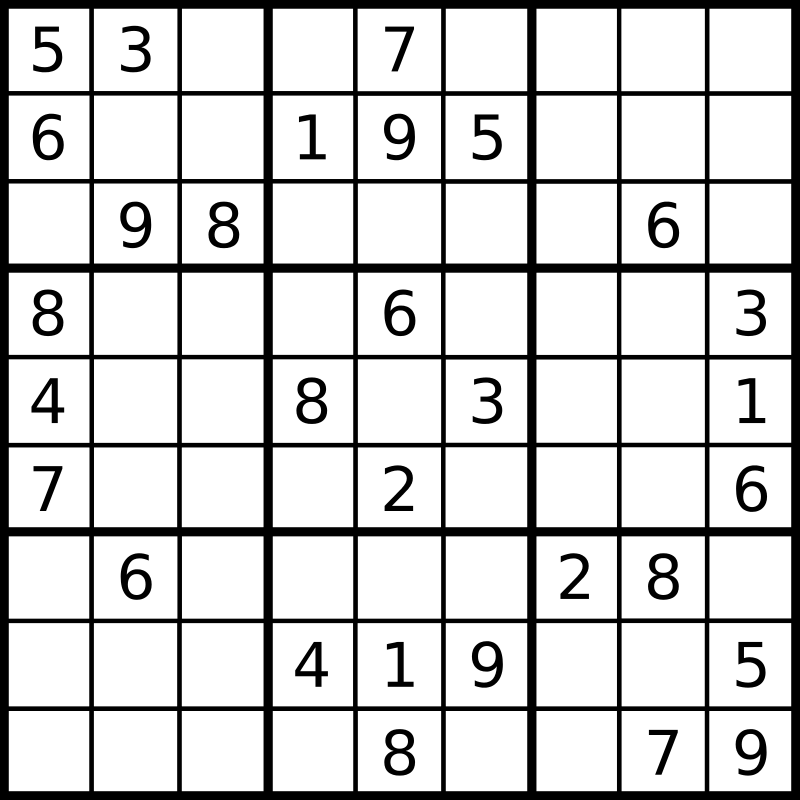


Resolver a grade de Sudoku recai no chamado problema NP-Completo (Lynce e Ouaknine, 2006 fazem um trabalho mostrando a equivalência do Sudoku ao problema de <!--termo técnico-->satisfatibilidade booleana<!-- --> - SAT, provando assim que ele é do tipo NP-Completo). Ou seja, usar força bruta para resolver esse problema tem um custo computacional elevado.

## Máquina de Turing

A Máquina de Turing é um computador abstrato formado por uma fita, representando a memória, que tem um começo de um lado mas é infinita do outro, um cabeçote para ler e escrever na fita, lembrando um rádio toca fitas antigo. Essa máquina é usada para representar o processo de computação. A partir dela é possível determinar os limites do que é possível ser resolvido via computador. Assim, a definição formal de algoritmo é: um programa que pode ser interpretado por alguma máquina de Turing. Se para um dado problema não existir uma máquina de Turing que o resolva, então não existe um algoritmo para resolver o problema.

Turing também mostra que sua máquina abstrata é equivalente ao Cálculo-Lambda de Alonzo Church. Com isso, a definição formal de algoritmo, em termos da máquina de Turing, ficou conhecida como Tese de Church-Turing. O termo tese aqui é usado para indicar que até o momento, não sabemos se existe um modelo computacional mais potente que a máquina de Turing. Mesmo um computador quântico seria equivalente a uma máquina de Turing estocástica, a qual pode ser reduzida a uma máquina de Turing comum. Existe trabalhos tentando encontrar problemas que só poderiam ser resolvidos via computação quântica, mas isso ainda é um campo em aberto.

A partir do trabalho de Alan Turing (1936) passou a ficar claro quais os limites da computação, sendo possível provar, utilizando técnicas formais, que certos problemas não podem ser resolvidos usando algoritmos. Com esse trabalho nasce a Ciência da Computação como um ramo completamente novo.

Um caso de problema que não tem solução algorítmica é o chamado problema da parada. Esse caso consiste em escrever um programa capaz de verificar se um outro programa irá executar para sempre, como num laço infinito, ou não.

> **Máquina de Turing determinística**
> De forma geral, uma máquina de Turing determinística é aquela que reconhece uma linguagem (resolver um problema) de forma bem determinada, como em programação estruturada, seguindo um passo de cada vez.


> **Máquina de Turing não-determinística**
> A máquina de Turing não-determinística é uma máquina capaz de explorar várias soluções possíveis de forma simultânea, explorando todas as soluções determinísticas de uma só vez. Esse efeito é similar ao que se espera de um computador quântico.


> **Tempo polinomial**
> Um polinômio é uma expressão matemática do tipo a<sub>0</sub>x<sup>0</sup>+a<sub>1</sub>x<sup>1</sup>+...+a<sub>k</sub>x<sup>k</sup>, sendo k o maior termo do polinômio. Se para um entrada de tamanho n o número de passos para chegar a uma resposta puder ser descrito por um polinômio, então dizermos que o tempo de processamento do algoritmo é polinomial.

## A questão de P versus NP

Em Ciência da Computação, um problema é chamado do tipo P (Polinomial), se existe uma máquina de Turing determinística capaz de resolvê-lo em tempo polinomial. Por exemplo, ordenar lista de números é um problema relativamente simples, no qual, usando poucos laços de repetição é possível criar um programa para resolver esse problema. Por outro lado, problemas NP são aqueles que podem ser resolvidos em tempo polinomial somente usando uma máquina de Turing não-determinísticas (O N do NP vem de "não-determinísticas"). São problemas difíceis de resolver, tomando muito tempo para ser solucionado (de horas a séculos) num computador determinístico. Problemas NP-completos são aqueles que podem ser solucionados de forma equivalente, ou seja, o mesmo perfil de algoritmo é capaz de resolver um conjunto de problemas do tipo NP. Esse processo de converter um problema em outro é chamado de redutibilidade.

Um grande desafio da atualidade é saber se  existe uma forma mais fácil de resolver problemas do tipo NP, o que indicaria que esse problemas são do tipo P.Muitos algoritmos de criptografia são do tipo NP, logo, se P é igual a NP, então os programas de criptografia poderiam ser facilmente quebrados, resolvidos em tempo polinomial por computadores ordinários.

O outro caso da quebra de criptografia está ligado a computação quântica, pois esse computadores seriam equivalentes a máquina de Turing não determinística, sendo capazes de resolver de forma fácil os problemas do tipo NP.

## Solucionando Sudoku via algoritmo genético.

Num artigo de 2009, Weiss conclui que o uso de algoritmo genético não era a melhor opção para resolver Sudoku, mas que resolver esse problema poderia ser interessante para que os alunos pudessem entender melhor as aplicações da metodologia.

Usando uma implementação customizada de algoritmo genético, Mantere e Kolojonen (2007), conseguiram resolver de forma eficiente Sudokus. Indicando que a escolha dos operadores genético pode sim interferir na busca de soluções.

Apesar de ser uma brincadeira e que em muitos casos é fácil de ser resolvido por um ser humano, escrever um algoritmo eficiente para resolver o Sudoku é algo bem complexo, servindo para testar os limites da inteligência artificial.

Na figura a seguir é apresentado um caso de um Sudoku difícil de ser resolvido via algoritmo, mas que aparentemente é fácil de resolver para um humano.

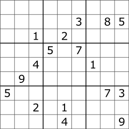

No próximo capítulo será apresentado a construção do algoritmo usando para avaliar uma tabela de Sudoku.


## Algoritmo de avaliação do Sudoku

Para avaliar um indivíduo vamos criar um sistema de perda e recompensa. Cada vez que um trecho de código, representando um número que se encaixa perfeitamente em um quadrado, teremos um ponto de bônus. Para cada regra quebrada, uma perda será atribuída, (numero repetido na coluna, linha ou sub-grade). Também precisamos avaliar se existe alguma situação em que não é  possível encaixar qualquer número restante numa sub-grade. Nesse caso, a solução será considerada inválida e perderá cem mil pontos. Um outro teste será o de verificar se, quando estiver faltando menos de dez casas vazias no jogo, se já é possível completar com os números que faltam. Se nesse caso não for possível encontrar a solução, então a população será reinicializada por completa.

Vamos também implementar um algoritmo de força bruta, baseado no que foi apresentado por Ganguly (2018). Para o algoritmo genético, o que iremos fazer é verificar se, a partir de uma dada solução gerada, se é possível completar o quadro do completo com uma única passagem, o que indicaria que achamos o ramo correto da solução. Assim, ao invés de fazer uma busca por força bruta, estamos criando um mecanismo de busca estocástica baseada em algoritmo genético.

Todas esses testes serão usados na função de avaliação e estaremos convertendo a busca de solução para o Sudoku num problema de optimização, em que se busca a solução que oferece a maior pontuação possível para o problema.


Vamos começar criando a classe `Sudoku`, no qual implementaremos os testes de validade e pontuação básica.

Na raiz do projeto, vamos criar o arquivo `sudoku.py`. Nesse arquivo, a declaração da classe e seu construtor será:

```python
class Sudoku:
    def __init__(self):

        self._sudoku = None
        self.solucao = None
        self._possiveis = array([1, 2, 3, 4, 5, 6, 7, 8, 9])
        self._quadrante_linha = {0:0, 1:3, 2:6}
        self._quadrante_coluna = {0:0, 1:3, 2:6}
        self._quadrantes = [[0,0], [0,1], [0, 2],
                            [1,0], [1,1], [1, 2],
                            [2,0], [2,1], [2, 2]
                            ]
        self._perda = -1
        self._bonus = 1
```


Os *getters* e *setters* dos atributos privados são:

 ```python
 @property
 def perda(self):
     return self._perda

 @property
 def bonus(self):
     return self._bonus

 def _get_sudoku(self):
     return self._sudoku

 def _set_sudoku(self, sudoku):
     self._sudoku = sudoku
```

A cartela de jogo será representada por uma matriz 9x9. O valor 0 indica casa vazia. O próximo método retorna um quadrante, sendo que os quadrantes possíveis estão armazenados no atributo `_quadrantes`:

 ```python
 def quadrante(self, x, y):
     tmp = split(self.solucao, 3)
     quad = []

     for sub in tmp:
         sub2 = split(sub, 3, axis=1)
         tmp2 = []
         for sub3 in sub2:
             tmp2.append(sub3.tolist())
         quad.append(tmp2)

     quad = array(quad)
     subquad = quad[x, y]
     return subquad
 ```

 Em seguida, criaremos um método para verificar quais são os números que faltam para completar um quadrante:

 ```python
 def _numeros_no_quadrante(self, x, y):
     quadrante = self.quadrante(x, y)
     l0 = self._quadrante_linha[x]
     c0 = self._quadrante_coluna[y]

     linhas, colunas = where(quadrante == 0)
     if linhas.size != 0:
         linhas = linhas + l0
         colunas = colunas + c0
         testar = self._possiveis[~isin(self._possiveis, quadrante)]

         ij = list(zip(linhas, colunas))
         return testar, ij
     return None, None
 ```

 Sabendo quais são os números que faltam preencher, precisamos saber se existe alguma casa vazia em que não é possível colocar nenhum desses números. Isso significa que aquele jogo jamais poderá ser finalizado, logo iremos dizer que esse é um jogo ilegal:

 ```python
 def ilegal_no_quadrante(self, x, y):
     """
     Verifica se em algum quadrante existe posição vazia que não pode ser
     preenchida por um número.
     """
     testar, ij = self._numeros_no_quadrante(x, y)
     if testar is not None:

         invalidas = 0

         for i, j in ij:
             tmp = 0
             for numero in testar:
                 a = count_nonzero(self.solucao[i, :] == numero)
                 b = count_nonzero(self.solucao[:, j] == numero)
                 if a != 0 or b != 0:
                     tmp += 1

             if tmp == testar.size:
                 invalidas += 1

         return invalidas
     return 0
```


Um outro método irá retornar a soma total de quadrantes ilegais numa jogada:

 ```python
 def total_ilegais(self):
     ilegais = sum([self.ilegal_no_quadrante(xy[0], xy[1])
                    for xy in self._quadrantes])
     return ilegais
```


Para validar a posição de um número, é necessário saber se não existe repetições do mesmo, tanto para a linha, quanto para a coluna:

```python
def verificar(self, numero, linha, coluna):
    if numero < 1 or numero > 9:
        return -1000000000

    valorlc = self._perda * count_nonzero(self.solucao[linha,:] == numero)
    valorlc += self._perda * count_nonzero(self.solucao[:,coluna] == numero)
    valorlc += self.verificar_repeticoes(numero, linha, coluna, valorlc)

    if valorlc > 0:
        self.solucao[linha, coluna] = numero
        return self._bonus
    return valorlc
```

Se não existem restrições para colocar o número, o mesmo será encaixado no vetor `solucao`.  Vamos adicionar uma punição extra, caso não seja possível adicionar o número, se a repetição for causada pela própria solução. O objetivo aqui é favorecer solução com uma maior distribuição de valores ao longo do vetor solução:

```python
def verificar_repeticoes(self, numero, linha, coluna, valorlc):

    x, y = (int(linha / 3), int(coluna / 3))
    subquad = self.quadrante(x, y)
    repeticoes = count_nonzero(subquad == numero)
    nzeros = count_nonzero(subquad == 0)

    if repeticoes != 0:
        return self._perda * 3

    if valorlc < 0:
        sudo_linha = count_nonzero(self.sudoku[linha,:] == numero)
        sudo_coluna = count_nonzero(self.sudoku[:,coluna] == numero)

        if sudo_linha != 0 or sudo_coluna != 0:
            return self._perda * 3
        return self._perda

    return self._bonus
```

## Algoritmo de força bruta.

O algoritmo de força bruta consiste em tentar preencher os quadrantes de uma só vez. Caso isso não seja possível, uma quadrante anterior é modificado, sendo que essa modificação poderá chegar até a primeira célula do jogo. <!-- Terminar Conceito gerando as figuras de exemplo-->


O código a seguir implementa a solução de força bruta. Esse algoritmo será usado para verificar se já é possível resolver o Sudoku usando apenas uma passagem, o que indicaria que essa é a solução que corresponde ao ramo correto do algoritmo de força bruta:

```python
def tentar_preencher(self, backtracking=False):
    if self.solucao is not None:
        original = self.solucao.copy()
        linha, coluna = where(self.solucao==0)
        licol = list(zip(linha, coluna))
        n = len(licol)
        l = 0
        while l < n:
            encaixou = 0
            i, j = licol[l][0], licol[l][1]
            inicio = self.solucao[i, j]
            self.solucao[i, j] = 0
            for numero in range(inicio + 1,10):
                encaixou = self.verificar(numero, i, j)
                if encaixou > 0:
                    break

            if encaixou > 0:
                l = l + 1
            else:
                if backtracking is True:
                    l = l -1
                else:
                    break

        tilegais =  self.total_ilegais()
        self.solucao, original = original, self.solucao
        return  n - l, tilegais, original

    return None, None, None
 ```
Com esse último método,  ao invés de buscarmos um indivíduo representando todos os números da solução, o que
faremos é buscar um indivíduo que contenha números que podem ser encaixados para formar um ramo da solução. Com isso, não precisamos vasculhar todas as possibilidades, mas apenas mapear possíveis arranjos que possam acelerar a busca pela solução final. Note que o método recebe com parâ


 ## Finalizando a classe.

 Nó próximo código vemos a classe `Sudoku` por completo:

 ```python
 from numpy import zeros, array, split, hsplit, where, count_nonzero, concatenate
 from numpy import isin
 from numpy.random import randint, choice, shuffle
 import random


 class Sudoku:
     def __init__(self):

         self._sudoku = None
         self.solucao = None
         self._possiveis = array([1, 2, 3, 4, 5, 6, 7, 8, 9])
         self._quadrante_linha = {0:0, 1:3, 2:6}
         self._quadrante_coluna = {0:0, 1:3, 2:6}
         self._quadrantes = [[0,0], [0,1], [0, 2],
                             [1,0], [1,1], [1, 2],
                             [2,0], [2,1], [2, 2]
                             ]
         self._perda = -1
         self._bonus = 1

     @property
     def perda(self):
         return self._perda
# Algoritmo de avaliação do Sudoku

Para avaliar um indivíduo vamos criar um sistema de perda e recompensa. Cada vez que um trecho de código, representando um número que se encaixa perfeitamente em um quadrado, teremos um ponto de bônus. Para cada regra quebrada, uma perda será atribuída, (numero repetido na coluna, linha ou sub-grade). Também precisamos avaliar se existe alguma situação em que não é  possível encaixar qualquer número restante numa sub-grade. Nesse caso, a solução será considerada inválida e perderá cem mil pontos. Um outro teste será o de verificar se, quando estiver faltando menos de dez casas vazias no jogo, se já é possível completar com os números que faltam. Se nesse caso não for possível encontrar a solução, então a população será reinicializada por completa.

Vamos também implementar um algoritmo de força bruta, baseado no que foi apresentado por Ganguly (2018). Para o algoritmo genético, o que iremos fazer é verificar se, a partir de uma dada solução gerada, se é possível completar o quadro do completo com uma única passagem, o que indicaria que achamos o ramo correto da solução. Assim, ao invés de fazer uma busca por força bruta, estamos criando um mecanismo de busca estocástica baseada em algoritmo genético.

Todas esses testes serão usados na função de avaliação e estaremos convertendo a busca de solução para o Sudoku num problema de optimização, em que se busca a solução que oferece a maior pontuação possível para o problema.


Vamos começar criando a classe `Sudoku`, no qual implementaremos os testes de validade e pontuação básica.

Na raiz do projeto, vamos criar o arquivo `sudoku.py`. Nesse arquivo, a declaração da classe e seu construtor será:

```python
class Sudoku:
    def __init__(self):

        self._sudoku = None
        self.solucao = None
        self._possiveis = array([1, 2, 3, 4, 5, 6, 7, 8, 9])
        self._quadrante_linha = {0:0, 1:3, 2:6}
        self._quadrante_coluna = {0:0, 1:3, 2:6}
        self._quadrantes = [[0,0], [0,1], [0, 2],
                            [1,0], [1,1], [1, 2],
                            [2,0], [2,1], [2, 2]
                            ]
        self._perda = -1
        self._bonus = 1
```


Os *getters* e *setters* dos atributos privados são:

 ```python
 @property
 def perda(self):
     return self._perda

 @property
 def bonus(self):
     return self._bonus

 def _get_sudoku(self):
     return self._sudoku

 def _set_sudoku(self, sudoku):
     self._sudoku = sudoku
```

A cartela de jogo será representada por uma matriz 9x9. O valor 0 indica casa vazia. O próximo método retorna um quadrante, sendo que os quadrantes possíveis estão armazenados no atributo `_quadrantes`:

 ```python
 def quadrante(self, x, y):
     tmp = split(self.solucao, 3)
     quad = []

     for sub in tmp:
         sub2 = split(sub, 3, axis=1)
         tmp2 = []
         for sub3 in sub2:
             tmp2.append(sub3.tolist())
         quad.append(tmp2)

     quad = array(quad)
     subquad = quad[x, y]
     return subquad
 ```

 Em seguida, criaremos um método para verificar quais são os números que faltam para completar um quadrante:

 ```python
 def _numeros_no_quadrante(self, x, y):
     quadrante = self.quadrante(x, y)
     l0 = self._quadrante_linha[x]
     c0 = self._quadrante_coluna[y]

     linhas, colunas = where(quadrante == 0)
     if linhas.size != 0:
         linhas = linhas + l0
         colunas = colunas + c0
         testar = self._possiveis[~isin(self._possiveis, quadrante)]

         ij = list(zip(linhas, colunas))
         return testar, ij
     return None, None
 ```

 Sabendo quais são os números que faltam preencher, precisamos saber se existe alguma casa vazia em que não é possível colocar nenhum desses números. Isso significa que aquele jogo jamais poderá ser finalizado, logo iremos dizer que esse é um jogo ilegal:

 ```python
 def ilegal_no_quadrante(self, x, y):
     """
     Verifica se em algum quadrante existe posição vazia que não pode ser
     preenchida por um número.
     """
     testar, ij = self._numeros_no_quadrante(x, y)
     if testar is not None:

         invalidas = 0

         for i, j in ij:
             tmp = 0
             for numero in testar:
                 a = count_nonzero(self.solucao[i, :] == numero)
                 b = count_nonzero(self.solucao[:, j] == numero)
                 if a != 0 or b != 0:
                     tmp += 1

             if tmp == testar.size:
                 invalidas += 1

         return invalidas
     return 0
```


Um outro método irá retornar a soma total de quadrantes ilegais numa jogada:

 ```python
 def total_ilegais(self):
     ilegais = sum([self.ilegal_no_quadrante(xy[0], xy[1])
                    for xy in self._quadrantes])
     return ilegais
```


Para validar a posição de um número, é necessário saber se não existe repetições do mesmo, tanto para a linha, quanto para a coluna:

```python
def verificar(self, numero, linha, coluna):
    if numero < 1 or numero > 9:
        return -1000000000

    valorlc = self._perda * count_nonzero(self.solucao[linha,:] == numero)
    valorlc += self._perda * count_nonzero(self.solucao[:,coluna] == numero)
    valorlc += self.verificar_repeticoes(numero, linha, coluna, valorlc)

    if valorlc > 0:
        self.solucao[linha, coluna] = numero
        return self._bonus
    return valorlc
```

Se não existem restrições para colocar o número, o mesmo será encaixado no vetor `solucao`.  Vamos adicionar uma punição extra, caso não seja possível adicionar o número, se a repetição for causada pela própria solução. O objetivo aqui é favorecer solução com uma maior distribuição de valores ao longo do vetor solução:

```python
def verificar_repeticoes(self, numero, linha, coluna, valorlc):

    x, y = (int(linha / 3), int(coluna / 3))
    subquad = self.quadrante(x, y)
    repeticoes = count_nonzero(subquad == numero)
    nzeros = count_nonzero(subquad == 0)

    if repeticoes != 0:
        return self._perda * 3

    if valorlc < 0:
        sudo_linha = count_nonzero(self.sudoku[linha,:] == numero)
        sudo_coluna = count_nonzero(self.sudoku[:,coluna] == numero)

        if sudo_linha != 0 or sudo_coluna != 0:
            return self._perda * 3
        return self._perda

    return self._bonus
```

## Algoritmo de força bruta.

O algoritmo de força bruta consiste em tentar preencher os quadrantes de uma só vez. Caso isso não seja possível, uma quadrante anterior é modificado, sendo que essa modificação poderá chegar até a primeira célula do jogo. <!-- Terminar Conceito gerando as figuras de exemplo-->


O código a seguir implementa a solução de força bruta. Esse algoritmo será usado para verificar se já é possível resolver o Sudoku usando apenas uma passagem, o que indicaria que essa é a solução que corresponde ao ramo correto do algoritmo de força bruta:

```python
def tentar_preencher(self, backtracking=False):
    if self.solucao is not None:
        original = self.solucao.copy()
        linha, coluna = where(self.solucao==0)
        licol = list(zip(linha, coluna))
        n = len(licol)
        l = 0
        while l < n:
            encaixou = 0
            i, j = licol[l][0], licol[l][1]
            inicio = self.solucao[i, j]
            self.solucao[i, j] = 0
            for numero in range(inicio + 1,10):
                encaixou = self.verificar(numero, i, j)
                if encaixou > 0:
                    break

            if encaixou > 0:
                l = l + 1
            else:
                if backtracking is True:
                    l = l -1
                else:
                    break

        tilegais =  self.total_ilegais()
        self.solucao, original = original, self.solucao
        return  n - l, tilegais, original

    return None, None, None
 ```
Com esse último método,  ao invés de buscarmos um indivíduo representando todos os números da solução, o que
faremos é buscar um indivíduo que contenha números que podem ser encaixados para formar um ramo da solução. Com isso, não precisamos vasculhar todas as possibilidades, mas apenas mapear possíveis arranjos que possam acelerar a busca pela solução final. Note que o método recebe com parâ


 ## Finalizando a classe.

 Nó próximo código vemos a classe `Sudoku` por completo:

 ```python
 from numpy import zeros, array, split, hsplit, where, count_nonzero, concatenate
 from numpy import isin
 from numpy.random import randint, choice, shuffle
 import random


 class Sudoku:
     def __init__(self):

         self._sudoku = None
         self.solucao = None
         self._possiveis = array([1, 2, 3, 4, 5, 6, 7, 8, 9])
         self._quadrante_linha = {0:0, 1:3, 2:6}
         self._quadrante_coluna = {0:0, 1:3, 2:6}
         self._quadrantes = [[0,0], [0,1], [0, 2],
                             [1,0], [1,1], [1, 2],
                             [2,0], [2,1], [2, 2]
                             ]
         self._perda = -1
         self._bonus = 1

     @property
     def perda(self):
         return self._perda

     @property
     def bonus(self):
         return self._bonus

     def _get_sudoku(self):
         return self._sudoku

     def _set_sudoku(self, sudoku):
         self._sudoku = sudoku

     def quadrante(self, x, y):
         tmp = split(self.solucao, 3)
         quad = []

         for sub in tmp:
             sub2 = split(sub, 3, axis=1)
             tmp2 = []
             for sub3 in sub2:
                 tmp2.append(sub3.tolist())
             quad.append(tmp2)

         quad = array(quad)
         subquad = quad[x, y]
         return subquad

     def _numeros_no_quadrante(self, x, y):
         quadrante = self.quadrante(x, y)
         l0 = self._quadrante_linha[x]
         c0 = self._quadrante_coluna[y]

         linhas, colunas = where(quadrante == 0)
         if linhas.size != 0:
             linhas = linhas + l0
             colunas = colunas + c0
             testar = self._possiveis[~isin(self._possiveis, quadrante)]

             ij = list(zip(linhas, colunas))
             return testar, ij
         return None, None

     def ilegal_no_quadrante(self, x, y):
         """
         Verifica se em algum quadrante existe posição vazia que não pode ser
         preenchida por um número.
         """
         testar, ij = self._numeros_no_quadrante(x, y)
         if testar is not None:

             invalidas = 0

             for i, j in ij:
                 tmp = 0
                 for numero in testar:
                     a = count_nonzero(self.solucao[i, :] == numero)
                     b = count_nonzero(self.solucao[:, j] == numero)
                     if a != 0 or b != 0:
                         tmp += 1

                 if tmp == testar.size:
                     invalidas += 1

             return invalidas
         return 0

     def total_ilegais(self):
         ilegais = sum([self.ilegal_no_quadrante(xy[0], xy[1])
                        for xy in self._quadrantes])
         return ilegais

     def verificar(self, numero, linha, coluna):
         if numero < 1 or numero > 9:
             return -1000000000

         valorlc = self._perda * count_nonzero(self.solucao[linha,:] == numero)
         valorlc += self._perda * count_nonzero(self.solucao[:,coluna] == numero)
         valorlc += self.verificar_repeticoes(numero, linha, coluna, valorlc)

         if valorlc > 0:
             self.solucao[linha, coluna] = numero
             return self._bonus
         return valorlc

     def verificar_repeticoes(self, numero, linha, coluna, valorlc):

         x, y = (int(linha / 3), int(coluna / 3))
         subquad = self.quadrante(x, y)
         repeticoes = count_nonzero(subquad == numero)
         nzeros = count_nonzero(subquad == 0)

         if repeticoes != 0:
             return self._perda * 3

         if valorlc < 0:
             sudo_linha = count_nonzero(self.sudoku[linha,:] == numero)
             sudo_coluna = count_nonzero(self.sudoku[:,coluna] == numero)

             if sudo_linha != 0 or sudo_coluna != 0:
                 return self._perda * 3
             return self._perda

         return self._bonus

     def tentar_preencher(self, backtracking=False):
         if self.solucao is not None:
             original = self.solucao.copy()
             linha, coluna = where(self.solucao==0)
             licol = list(zip(linha, coluna))
             n = len(licol)
             l = 0
             while l < n:
                 encaixou = 0
                 i, j = licol[l][0], licol[l][1]
                 inicio = self.solucao[i, j]
                 self.solucao[i, j] = 0
                 for numero in range(inicio + 1,10):
                     encaixou = self.verificar(numero, i, j)
                     if encaixou > 0:
                         break

                 if encaixou > 0:
                     l = l + 1
                 else:
                     if backtracking is True:
                         l = l -1
                     else:
                         break
             self.solucao, original = original, self.solucao
             return n - l, original
         return None, None

     sudoku = property(_get_sudoku, _set_sudoku)
 ```

 ```python

     @property
     def bonus(self):
         return self._bonus

     def _get_sudoku(self):
         return self._sudoku

     def _set_sudoku(self, sudoku):
         self._sudoku = sudoku

     def quadrante(self, x, y):
         tmp = split(self.solucao, 3)
         quad = []

         for sub in tmp:
             sub2 = split(sub, 3, axis=1)
             tmp2 = []
             for sub3 in sub2:
                 tmp2.append(sub3.tolist())
             quad.append(tmp2)

         quad = array(quad)
         subquad = quad[x, y]
         return subquad

     def _numeros_no_quadrante(self, x, y):
         quadrante = self.quadrante(x, y)
         l0 = self._quadrante_linha[x]
         c0 = self._quadrante_coluna[y]

         linhas, colunas = where(quadrante == 0)
         if linhas.size != 0:
             linhas = linhas + l0
             colunas = colunas + c0
             testar = self._possiveis[~isin(self._possiveis, quadrante)]

             ij = list(zip(linhas, colunas))
             return testar, ij
         return None, None

     def ilegal_no_quadrante(self, x, y):
         """
         Verifica se em algum quadrante existe posição vazia que não pode ser
         preenchida por um número.
         """
         testar, ij = self._numeros_no_quadrante(x, y)
         if testar is not None:

             invalidas = 0

             for i, j in ij:
                 tmp = 0
                 for numero in testar:
                     a = count_nonzero(self.solucao[i, :] == numero)
                     b = count_nonzero(self.solucao[:, j] == numero)
                     if a != 0 or b != 0:
                         tmp += 1

                 if tmp == testar.size:
                     invalidas += 1

             return invalidas
         return 0

     def total_ilegais(self):
         ilegais = sum([self.ilegal_no_quadrante(xy[0], xy[1])
                        for xy in self._quadrantes])
         return ilegais

     def verificar(self, numero, linha, coluna):
         if numero < 1 or numero > 9:
             return -1000000000

         valorlc = self._perda * count_nonzero(self.solucao[linha,:] == numero)
         valorlc += self._perda * count_nonzero(self.solucao[:,coluna] == numero)
         valorlc += self.verificar_repeticoes(numero, linha, coluna, valorlc)

         if valorlc > 0:
             self.solucao[linha, coluna] = numero
             return self._bonus
         return valorlc

     def verificar_repeticoes(self, numero, linha, coluna, valorlc):

         x, y = (int(linha / 3), int(coluna / 3))
         subquad = self.quadrante(x, y)
         repeticoes = count_nonzero(subquad == numero)
         nzeros = count_nonzero(subquad == 0)

         if repeticoes != 0:
             return self._perda * 3

         if valorlc < 0:
             sudo_linha = count_nonzero(self.sudoku[linha,:] == numero)
             sudo_coluna = count_nonzero(self.sudoku[:,coluna] == numero)

             if sudo_linha != 0 or sudo_coluna != 0:
                 return self._perda * 3
             return self._perda

         return self._bonus

     def tentar_preencher(self, backtracking=False):
         if self.solucao is not None:
             original = self.solucao.copy()
             linha, coluna = where(self.solucao==0)
             licol = list(zip(linha, coluna))
             n = len(licol)
             l = 0
             while l < n:
                 encaixou = 0
                 i, j = licol[l][0], licol[l][1]
                 inicio = self.solucao[i, j]
                 self.solucao[i, j] = 0
                 for numero in range(inicio + 1,10):
                     encaixou = self.verificar(numero, i, j)
                     if encaixou > 0:
                         break

                 if encaixou > 0:
                     l = l + 1
                 else:
                     if backtracking is True:
                         l = l -1
                     else:
                         break
             self.solucao, original = original, self.solucao
             return n - l, original
         return None, None

     sudoku = property(_get_sudoku, _set_sudoku)
 ```


 ## Sudoku como problema de optimização


 No capítulo anterior vimos usar o algoritmo genético para resolver o Sudoku com exatidão não é a melhor opção. Uma estratégia alternativa é de usar os indivíduos para mapear possíveis ramos de soluções, no lugar de soluções completas. Ou seja, não precisamos ter indivíduos geneticamente perfeitos, mas precisamos apenas que os indivíduos possuam traços de uma possível perfeição, para se chegar a solução.


 ## Redutibilidade

 Sipser (2007) apresenta que na redutibilidade por mapeamento, um problema A pode ser reduzido ao problema B usando uma função computável que converte instâncias do problema B.

 Assim, para resolver Sudoku iremos mapear as relações entre profundidade do ramo da solução corrente, número ilegal de jogadas, tanto para a solução incompleta quanto para a tentativa de completar o ramo, além é claro da pontuação que cada indivíduos ganha ao se utilizar o método `verificar` da classe `Sudoku`.

 Vamos criar uma função que mapeia  quantas casas faltam para  completar uma solução, através de uma única passagem do algoritmo de força bruta, e quantas jogadas ilegais são geradas nesse caso. Uma característica importante dessa função é que seu máximo deverá ocorrer quando ambos, casas faltantes para completar a jogada e número de casas ilegais, chegue a zero. Uma função com tais característica é a seguinte:

 F(x, y) = -((x + y) / (C<sub>0</sub>x + 1.0) + (x + y<sup>C<sub>1</sub></sup>) / (y + 1.0)),

 Sendo C<sub>0</sub>, C<sub>1</sub>  constantes.

 A função objetivo que iremo usar será:

 O(u, v, x, y) = A<sub>0</sub>u + A<sub>1</sub> v + A<sub>2</sub>F(x,y),

 em que A<sub>0</sub>, A<sub>1</sub>, A<sub>2</sub> são constantes.

 A figura a seguir é para o caso de A<sub>0</sub>=0, A<sub>1</sub>=1, A<sub>2</sub>=0.1, C<sub>0</sub>=0.001 e C<sub>0</sub>=3.

 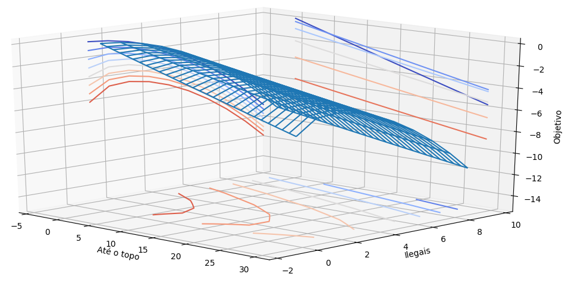


 Note que na função objetivo u representa a soma da pontuação total dada para a solução, com relação ao método `verificar`, v é o número total de células ilegais, dado pelo método `total_ilegais`, x e y são, respectivamente, o primeiro e o segundo termo retornado pelo método `tentar_preencher`. Sendo que x indica o  o quanto faltou para completar a tabela e y o número de células ilegais que foram gerados nessa tentativa.

 Vale lembrar que quadrantes ilegais são aqueles, que devido a posição do números que preenchem a solução, não fica sendo possível completar com qualquer outro número faltante no sub-quadrante.

 Nossa função deverá chegar ao máximo quando u for positivo e as variáveis v, x e y forem iguais a zero.
 Os valores das constantes deverão ser calibrados para acelerar o processo de busca. Por exemplo, podemos colocar um valor bem negativo para A<sub>1</sub> para logo no início descartas as soluções que estiverem com muitos quadrantes ilegais.

 Os valores usados aqui serão: A<sub>0</sub>=10, A<sub>1</sub>=-100000, A<sub>2</sub>=1000, C<sub>0</sub>=0.001, C<sub>1</sub>=3.

 Na próxima seção será implementado o algoritmo de redução do Sudoku para o problema de optimização, bem como o algoritmo genético para a busca da solução.

 ## Solucionar o Sudoku


 Na pasta raiz do projeto, vamos criar o arquivo `solucionarsudoku.py`, o qual conterá a classe `SolucionarSudoku`. Para esse projeto importaremos os seguintes módulos:

 ```python
 import time

 from numpy import array, count_nonzero, where
 from numpy import hsplit, concatenate

 from pygenec.populacao import Populacao
 from pygenec.selecao.torneio import Torneio
 from pygenec.cruzamento.embaralhamento import Embaralhamento
 from pygenec.mutacao.sequenciareversa import SequenciaReversa
 from pygenec.evolucao import Evolucao

 from pygenec.tools import bcolors, binarray2int
 ```


 A declaração da classe e seu construtor é:

 ```python
 class SolucionarSudoku:
     """
     SolucionarSudoku: Tenta encontrar a solução do
                       sudoku usando algoritmo genético.

     Entrada:
         sudoku: objeto do tipo Sudoku.
         bits: Número de bits por cromossomo.
         tamanho_populacao: Tamanho da população a ser usada na busca.
     """

     def __init__(self, sudoku, bits, tamanho_populacao):
         """Constrututor da classe."""
         self.sudoku = sudoku
         self.bits = bits
         self.cromossomos = self.sudoku.numero_de_casas_vazias()
         self.tamanho_populacao = tamanho_populacao
         self.populacao = None
         self.cruzamento = None
         self.mutacao = None
         self.evolucao = None
 ```

 Essa classe recebe o objeto avaliador do Sudoku, o número de bits por cromossomo e o tamanho total da população a ser usada para avaliar as possíveis soluções.

 ### Estrutura do algoritmo genético e função de avaliação

 Vamos criar um método para inicializar o algoritmo genético:

 ```python
 def inicializar(self, pmut=0.5, pcruz=0.1, epidemia=50, elitista=True):
     """Inicializa o algoritmo genético para."""
     tamanho = int(0.1 * self.tamanho_populacao)
     genes = self.bits * self.cromossomos

     self.populacao = Populacao(self.avaliacao,
                                genes,
                                self.tamanho_populacao)

     self.selecao = Torneio(self.populacao, tamanho=tamanho)
     self.cruzamento = Embaralhamento(self.tamanho_populacao)
     self.mutacao = SequenciaReversa(pmut=pmut)

     self.evolucao = Evolucao(self.populacao,
                              self.selecao,
                              self.cruzamento,
                              self.mutacao)

     self.evolucao.nsele = tamanho
     self.evolucao.pcruz = pcruz
     self.evolucao.epidemia = epidemia
     self.evolucao.manter_melhor = elitista
 ```


 O próximo método converte a sequência genética de uma população em números inteiros no intervalo de 1 até 9:

 ```python
 def valores(self, populacao):
     """Converte cromossomos em números inteiros entre 1 e 9."""
     bx = hsplit(populacao, self.cromossomos)
     const = 2 ** self.bits - 1
     const = (10 - 1) / const
     x = [1 + const * binarray2int(xi) for xi in bx]
     x = concatenate(x).T.astype(int)
     return x
 ```


 A função de avaliação será a seguinte:

 ```python
 def avaliacao(self, populacao):
     """Função de Avalização da população."""
     linhas, colunas = where(self.sudoku.sudoku == 0)
     x = self.valores(populacao)

     peso = []
     for k in range(len(populacao)):
         self.sudoku.solucao = self.sudoku.sudoku.copy()
         y = x[k, :].copy()
         data = list(zip(y, linhas, colunas))

         tmp = 10 * sum([self.sudoku.verificar(num, i, j)
                         for num, i, j in data
                         ])

         tmp += 100000 * self.sudoku.perda * self.sudoku.total_ilegais()

         profundidade, ilegais, resposta = self.sudoku.tentar_preencher()
         if profundidade is not None:
             objetivo = (profundidade + ilegais) / \
                 (1e-3 * profundidade + 1.0)
             objetivo += (profundidade + ilegais ** 3) / (ilegais + 1.0)
             tmp += self.sudoku.perda * int(1000 * objetivo)

         peso.append(tmp)

     peso = array(peso)
     return peso
 ```


 ### Execução da sequência de código

 Nosso critério de convergência será dada pelo tamanho do ramo de solução, o qual será avaliado no seguinte método:

 ```python
 def solucionar(self, reiniciar_apos=500):
     """Realiza a busca pela solução do Sudoku."""
     convergencia = 10000
     sem_mudancas = 0
     ultima_mudanca = -10
     t0 = time.time()
     solucoes_ruins = []

     while convergencia > 0:
         valor, vmin = self.evolucao.evoluir()

         convergencia, ilegais, resposta = self._verificar()

         self._exibir_resposta(convergencia, ilegais, resposta, valor, vmin)

         if len(solucoes_ruins) != 0:
             if self.populacao.populacao[-1].tolist() in solucoes_ruins:
                 print("Repetindo Minimo Local: Reiniciar")
                 self.populacao.gerar_populacao()

         if ultima_mudanca == convergencia:
             sem_mudancas += 1
             if sem_mudancas == reiniciar_apos:
                 print("Minimo Local, Reiniciar")
                 solucoes_ruins.append(
                     self.populacao.populacao[-1].tolist())
                 self.populacao.gerar_populacao()
                 sem_mudancas = 0
         else:
             sem_mudancas = 0

         ultima_mudanca = convergencia
         if convergencia == 0:
             break

     print("Tempo: ", (time.time() - t0) / 60)
     print("\n")
 ```

 Os métodos auxiliares que usaremos aqui são, para avaliar a profundidade do ramo:

 ```python
 def _verificar(self):
     """Verifica se já encontrou o ramo correto de solução."""
     self.sudoku.solucao = self.sudoku.sudoku.copy()
     v = self.valores(self.populacao.populacao)[-1]
     linha, coluna = where(self.sudoku.solucao == 0)
     data = list(zip(v, linha, coluna))
     for n, k, j in data:
         self.sudoku.verificar(n, k, j)
     return self.sudoku.tentar_preencher()
 ```


 Exibir na tela a resposta corrente:

 ```python
 def _exibir_resposta(self, convergencia, ilegais, resposta, valor, vmin):
     """Exibe na tela a resposta atual."""
     print("Geração: {}".format(self.evolucao.geracao))

     print("Para Superficie:{0}, Ilegais:{1}".format(convergencia,
                                                     ilegais))
     if convergencia == 0:
         tmp = resposta.astype(str)
     else:
         tmp = self.sudoku.solucao.astype(str)

     print(self.cromossomos - convergencia, self.cromossomos, valor, vmin)
     linha, coluna = where(self.sudoku.sudoku == 0)

     for k, j in zip(linha, coluna):
         if tmp[k, j] != "0":
             tmp[k, j] = "{0}{1}{2}".format(bcolors.WARNING,
                                            tmp[k, j],
                                            bcolors.ENDC)
     tmp2 = ""

     for l in range(tmp.shape[0]):
         tmp2 += "|" + ", ".join(tmp[l]) + "|\n"
     print(tmp2)
     print("\n")
 ```


 ### Código completo

 A seguir, vemos o conteúdo completo do arquivo `solucionarsudoku.py`:

 ```python
 #!/usr/bin/env python3.6
 # -*- Coding: UTF-8 -*-
 """
 Usa algoritmo genético para resolver o sudoku.
 """

 import time

 from numpy import array, count_nonzero, where, hsplit, concatenate, exp

 from pygenec.populacao import Populacao
 from pygenec.selecao.torneio import Torneio
 from pygenec.cruzamento.embaralhamento import Embaralhamento
 from pygenec.mutacao.sequenciareversa import SequenciaReversa
 from pygenec.evolucao import Evolucao

 from pygenec.tools import bcolors, binarray2int


 class SolucionarSudoku:
     """
     SolucionarSudoku: Tenta encontrar a solução do
                       sudoku usando algoritmo genético.

     Entrada:
         sudoku: objeto do tipo Sudoku.
         bits: Número de bits por cromossomo.
         tamanho_populacao: Tamanho da população a ser usada na busca.
     """

     def __init__(self, sudoku, bits, tamanho_populacao):
         """Constrututor da classe."""
         self.sudoku = sudoku
         self.bits = bits
         self.cromossomos = self.sudoku.numero_de_casas_vazias()
         self.tamanho_populacao = tamanho_populacao
         self.populacao = None
         self.cruzamento = None
         self.mutacao = None
         self.evolucao = None

     def inicializar(self, pmut=0.5, pcruz=0.1, epidemia=50, elitista=True):
         """Inicializa o algoritmo genético para."""
         tamanho = int(0.1 * self.tamanho_populacao)
         genes = self.bits * self.cromossomos

         self.populacao = Populacao(self.avaliacao,
                                    genes,
                                    self.tamanho_populacao)

         self.selecao = Torneio(self.populacao, tamanho=tamanho)
         self.cruzamento = Embaralhamento(self.tamanho_populacao)
         self.mutacao = SequenciaReversa(pmut=pmut)

         self.evolucao = Evolucao(self.populacao,
                                  self.selecao,
                                  self.cruzamento,
                                  self.mutacao)

         self.evolucao.nsele = tamanho
         self.evolucao.pcruz = pcruz
         self.evolucao.epidemia = epidemia
         self.evolucao.manter_melhor = elitista

     def valores(self, populacao):
         """Converte cromossomos em números inteiros entre 1 e 9."""
         bx = hsplit(populacao, self.cromossomos)
         const = 2 ** self.bits - 1
         const = (10 - 1) / const
         x = [1 + const * binarray2int(xi) for xi in bx]
         x = concatenate(x).T.astype(int)
         return x

     def avaliacao(self, populacao):
         """Função de Avalização da população."""
         linhas, colunas = where(self.sudoku.sudoku == 0)
         x = self.valores(populacao)

         peso = []
         for k in range(len(populacao)):
             self.sudoku.solucao = self.sudoku.sudoku.copy()
             y = x[k, :].copy()
             data = list(zip(y, linhas, colunas))

             tmp = 10 * sum([self.sudoku.verificar(num, i, j)
                             for num, i, j in data
                             ])

             tmp += 100000 * self.sudoku.perda * self.sudoku.total_ilegais()

             profundidade, ilegais, resposta = self.sudoku.tentar_preencher()
             if profundidade is not None:
                 objetivo = (profundidade + ilegais) / \
                     (1e-3 * profundidade + 1.0)
                 objetivo += (profundidade + ilegais ** 3) / (ilegais + 1.0)
                 tmp += self.sudoku.perda * int(1000 * objetivo)

             peso.append(tmp)

         peso = array(peso)
         return peso

     def _verificar(self):
         """Verifica se já encontrou o ramo correto de solução."""
         self.sudoku.solucao = self.sudoku.sudoku.copy()
         v = self.valores(self.populacao.populacao)[-1]
         linha, coluna = where(self.sudoku.solucao == 0)
         data = list(zip(v, linha, coluna))
         for n, k, j in data:
             self.sudoku.verificar(n, k, j)
         return self.sudoku.tentar_preencher()

     def _exibir_resposta(self, convergencia, ilegais, resposta, valor, vmin):
         """Exibe na tela a resposta atual."""
         print("Geração: {}".format(self.evolucao.geracao))

         print("Para Superficie:{0}, Ilegais:{1}".format(convergencia,
                                                         ilegais))
         if convergencia == 0:
             tmp = resposta.astype(str)
         else:
             tmp = self.sudoku.solucao.astype(str)

         print(self.cromossomos - convergencia, self.cromossomos, valor, vmin)
         linha, coluna = where(self.sudoku.sudoku == 0)

         for k, j in zip(linha, coluna):
             if tmp[k, j] != "0":
                 tmp[k, j] = "{0}{1}{2}".format(bcolors.WARNING,
                                                tmp[k, j],
                                                bcolors.ENDC)
         tmp2 = ""

         for l in range(tmp.shape[0]):
             tmp2 += "|" + ", ".join(tmp[l]) + "|\n"
         print(tmp2)
         print("\n")

     def solucionar(self, reiniciar_apos=500):
         """Realiza a busca pela solução do Sudoku."""
         convergencia = 10000
         sem_mudancas = 0
         ultima_mudanca = -10
         t0 = time.time()
         solucoes_ruins = []

         while convergencia > 0:
             valor, vmin = self.evolucao.evoluir()

             convergencia, ilegais, resposta = self._verificar()

             self._exibir_resposta(convergencia, ilegais, resposta, valor, vmin)

             if len(solucoes_ruins) != 0:
                 if self.populacao.populacao[-1].tolist() in solucoes_ruins:
                     print("Repetindo Minimo Local: Reiniciar")
                     self.populacao.gerar_populacao()

             if ultima_mudanca == convergencia:
                 sem_mudancas += 1
                 if sem_mudancas == reiniciar_apos:
                     print("Minimo Local, Reiniciar")
                     solucoes_ruins.append(
                         self.populacao.populacao[-1].tolist())
                     self.populacao.gerar_populacao()
                     sem_mudancas = 0
             else:
                 sem_mudancas = 0

             ultima_mudanca = convergencia
             if convergencia == 0:
                 break

         print("Tempo: ", (time.time() - t0) / 60)
         print("\n")
 ```


 ## Resolvendo o Sudoku

 Vamos criar um programa, que receberá como parâmetro o nome do arquivo contendo o sudoku a ser solucionado.
 O arquivo será um txt contendo valores separados por vírgula. Cada linha do arquivo representa uma linha da tabela do jogo. Um exemplo de arquivo válido é mostrado abaixo:

 ```
 0,0,0,3,0,0,0,0,4
 0,0,9,0,0,0,6,5,3
 0,2,0,0,5,4,0,1,0
 0,9,0,5,2,0,0,0,7
 0,0,0,1,0,7,0,0,0
 1,0,0,0,8,6,0,3,0
 0,8,0,6,3,0,0,4,0
 2,5,6,0,0,0,3,0,0
 9,0,0,0,0,1,0,0,0
 ```

 para executar o programa, no terminal, digitaremos o seguinte comando:

 ```bash
 python resolversudoku.py sudoku_facil_01.txt
 ```

 Aqui iremos importar os seguintes módulos:

 ```python
 import sys
 from numpy import loadtxt

 from sudoku import Sudoku
 from solucionarsudoku import SolucionarSudoku
 ```


 O código contido no programa será:

 ```python
 jogo = loadtxt(sys.argv[1], dtype=int, delimiter=",")
 sudoku = Sudoku()
 sudoku.sudoku = jogo
 solucionarsudoku = SolucionarSudoku(sudoku, 4, 30)
 solucionarsudoku.inicializar()
 solucionarsudoku.solucionar()
 ```


 A versão completa do código é:

 ```python
 #!/usr/bin/env python3.6
 # -*- Coding: UTF-8 -*-
 """
 Usa algoritmo genético para resolver o sudoku.
 """
 import sys
 from numpy import loadtxt

 from sudoku import Sudoku
 from solucionarsudoku import SolucionarSudoku

 jogo = loadtxt(sys.argv[1], dtype=int, delimiter=",")
 sudoku = Sudoku()
 sudoku.sudoku = jogo
 solucionarsudoku = SolucionarSudoku(sudoku, 4, 30)
 solucionarsudoku.inicializar()
 solucionarsudoku.solucionar()
 ```

 ## Resultados

 Para testar o algoritmo, foram utilizados jogos de Sudoku gerados a partir do site <http://www.opensky.ca/sudoku>. Para os experimentos foi utilizado um computador com processador Intel i7-7700HQ de 2,8GHz

 O primeiro jogo é classificado como fácil, e é mostrado a seguir:

 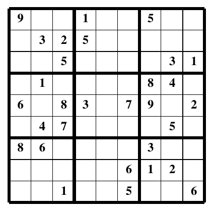

 Na próxima figura é apresentado a geração anterior em que se encontrará a resposta final:

 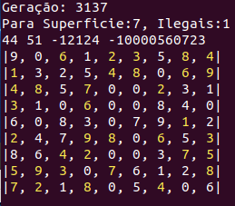

 A resposta final foi alcançada na geração 3138, levando 62 minutos para . O resultado final é mostrado a seguir:

 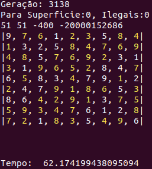


 O próximo exemplo é para um jogo de dificuldade média:

 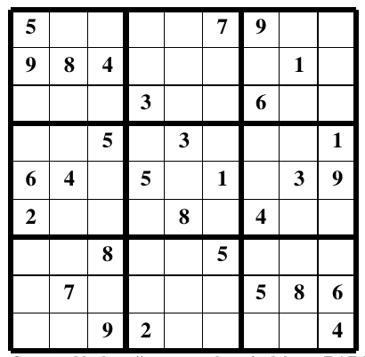

 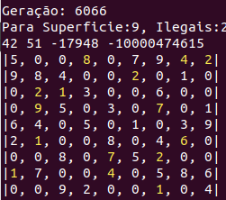

 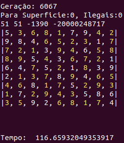


 O último teste foi realizado com um jogo difícil:

 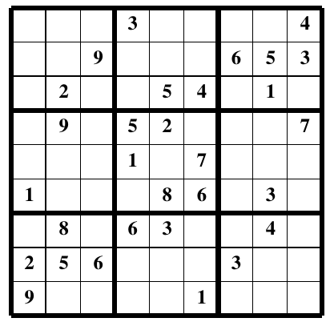

 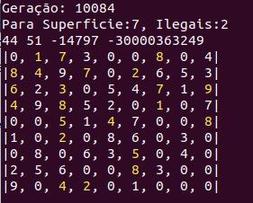

 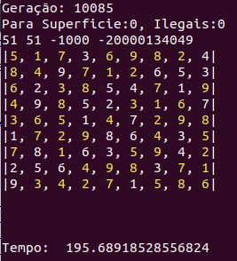


 ## Conclusão

 Resolver o Sudoku usando algoritmo genético pode não ser a opção mais eficiente. Contudo, modelar o problema e reduzir a maneira de solucionar o jogo, em termos de um processo de optimização é um exercício fundamental para se buscar métodos para resolver problemas que são intrisecamente difíceis de resolver através de computadores.
